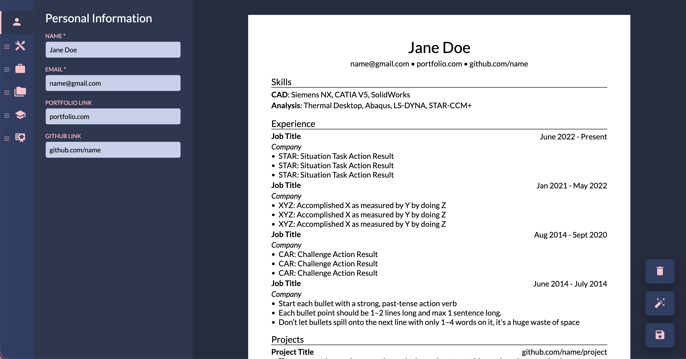

# buildR.

<h4>
    <a href="https://cv-buildr.vercel.app/" target="_blank">
        buildR. | Live Demo 🛠️
    </a>
</h4>

**buildR.** is a clean, modern, single-page resume builder that allows users to create, preview, and export a professional **A4 resume as a PDF**, entirely in the browser.

## Tech Stack

## Motivation

Many engineers struggle with resumes not due to lack of experience, but because of **poor structure and formatting**.

The [r/EngineeringResumes](https://www.reddit.com/r/EngineeringResumes/wiki/index/) community consistently showcases real-world résumés that successfully land interviews. One widely shared and battle-tested [Overleaf template](https://www.overleaf.com/project/662939053eb1dc8f0f3c617f) became a strong reference for what _actually works_ in practice.

This project translates that proven, no-nonsense résumé style into an **interactive web-based editor**, allowing users to:

- Focus on content instead of layout
- Maintain a strict, single-page A4 format
- Export a print-ready PDF without manual tweaking

## Features

- Section-based editor
- Live preview
- Strict A4 layout
- Export to PDF
